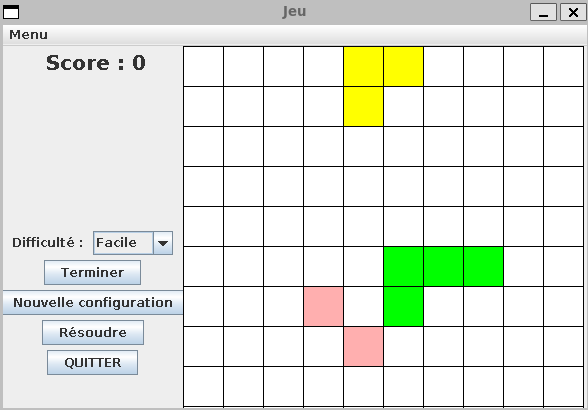

# Sorte de tetris/blokus

Ce projet a été réalisé au 1er semestre de 3eme année de licence informatique.
Il a été réalisé à 4.
Ceci est une courte description du projet

---

### Information
Il s’agit d’un jeu programmé en Java, dotée d’une interface graphique, qui consiste à assembler
des formes de sorte qu’elles occupent le moins de place possible. Le jeu peut se jouer sans
l’interface directement dans le terminal.
Un score est donc donné lorsque l'utilisateur a finis de disposé les pièces comme il le veut.

Le niveau de difficulté change le nombre de pièces.
3 pièces pour le niveau de difficulté facile
4 pour le niveau de difficulté moyenne
5 pour le niveau de difficulté difficile 

Lorsque l'utilisateur clique sur terminer le score final est affiché.
Si il clique sur nouvelle configuration cela va réinitialiser la grille et les pièces pour ainsi avoir de nouveau type de pièces. 
Sachant que la taille des pièces placés par défaut sur le plateau sont aléatoire et son aussi placé de manière aléatoire.
Le bouton résoudre permet d'avoir la configuration qui permet d'avoir le meilleurs score, cette configuration est donc affiché sur la grille juste après a voir cliqué sur le bouton.

Il est possible de connaitres les règles du jeu en cliquant sur le menu en haut à gauche.

Pour déplacer une pièce il faut cliquer dessus et maintenir le click tout en la déplaçant.
Il suffit de cliquer sur une pièces pour la faire pivoter.

---

### Quelques information techniques

#### MVC
Ce projet a été réalisé en utilisateur le modèle MVC. 
Le modèle **MVC (Modèle-Vue-Contrôleur)** est un motif d’architecture de logiciel qui est
utilisé pour structurer une application en séparant sa logique en trois parties distinctes :
- Le modèle : représente l’état et le comportement de l’application.
- La vue : représente la présentation graphique de l’application (différents éléments Swing).
- Le contrôleur : s’occupe de la gestion des interactions utilisateur et de la communication
entre le modèle et la vue.
Ce modèle nous permet de maintenir et de modifier le jeu plus facilement, car les différents
composants sont séparés les uns des autres.

#### Affichage

Ce jeu peut-etre lancé en version console ou en version graphique.
Pour la version graphique la bibliotheque graphique de Java swing a été utilisé.

#### Test

Afin de garantir la robustesse du code, nous avons effectué quelques tests. Par exemple,
nous avons d’abord vérifié, après la création d’un tableau et l’ajout de 3 pièces aléatoires, si les
différentes variables étaient bien initialisées (non nulles). Dans le second test, qui vérifie quant
à lui si on ajoute une pièce à un tableau, elle est bien ajoutée et si sa position correspond bien
à celle donnée.

---
### Lancement

(Il est necessaire d'avoir **ant** d'installer, cela était demandé par nos professeur)
Lancer le jeu (initialisation + compilation + test + lancement) :
- ant run
Lancer les tests (initialisation + compilation + test) :
- ant test
Générer la javadoc :
- ant javadoc
Générer l'archive .jar :
- ant packaging

#### Début de partie
En début de partie, des pièces sont généré aléatoirement sur le plateau puis il suffit de
choisir la pièce que l’on souhaite déplacer, si c’est la version console il faut précisé le nombre de
rotation puis préciser les nouvelles coordonnées, si c’est la partie graphique il suffit d’appuyer
sur la pièce pour changer son orientation et si on reste appuyé et qu’on la déplace, la pièce ce
déplacera où on l’a dirigé.

#### Fin de partie

En fin de partie, si l’on juge avoir fini la disposition des pièces on peut appuyer sur terminer
(partie graphique) ce qui va nous permettre de connaître le score de notre disposition.

---

### Conclusion
#### Proposition d'amélioration
Nous avons plusieurs idées pour de possibles améliorations pour ce projet :
- Un menu avec la possibilité de voir les meilleurs scores réalisés.
- La mise en place d’un nombre d’action maximal définis en fonction de la difficulté.
- Améliorer l’algorithme permettant d’afficher la meilleure disposition possible des pièces
selon la configuration actuelle.
- Pouvoir personnaliser le nombre de pièces présente par defaut sur le plateau
- Charger une configuration déjà créée.